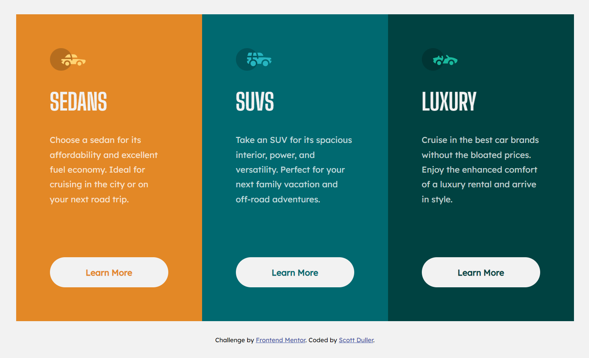

# Frontend Mentor - 3-column preview card component solution

This is a solution to the [3-column preview card component challenge on Frontend Mentor](https://www.frontendmentor.io/challenges/3column-preview-card-component-pH92eAR2-). Frontend Mentor challenges help you improve your coding skills by building realistic projects.

## Table of contents

-   [Overview](#overview)
    -   [The challenge](#the-challenge)
    -   [Screenshot](#screenshot)
    -   [Links](#links)
-   [My process](#my-process)
    -   [Built with](#built-with)
    -   [What I learned](#what-i-learned)
    -   [Continued development](#continued-development)
-   [Author](#author)

**Note: Delete this note and update the table of contents based on what sections you keep.**

## Overview

### The challenge

Users should be able to:

-   View the optimal layout depending on their device's screen size
-   See hover states for interactive elements

### Screenshot

<p align="center">

</p>

### Links

-   Solution URL: [Solution](https://github.com/scottduller/01-three-column-preview-card-component)
-   Live Site URL: [Live Site](https://scottduller.github.io/01-three-column-preview-card-component/)

## My process

### Built with

-   Semantic HTML5 markup
-   Flexbox
-   Mobile-first workflow
-   [React](https://reactjs.org/) - JS library
-   [Styled Components](https://styled-components.com/) - For styles

### What I learned

I learned how min-height worked and how using position: relative helps to position components as expected.

```js
export const Wrapper = styled.div`
	display: flex;
	flex-direction: column;
	position: relative;
	align-items: center;
	justify-content: center;
	gap: 1em;
	min-height: 100vh;
`;

export const Card = styled.div`
	display: flex;
	flex-direction: column;
	background-color: ${({ bg }) => bg};
	padding: 3.25em;
	gap: 2em;
	width: 22em;
	@media screen and (min-width: ${({ theme }) =>
			theme.breakpoints.desktop}) {
		padding: 4em;
	}
`;
```

### Continued development

I want to continue learning about positioning particularly focusing on `position: absolute` and `position: relative`.

## Author

-   Website - [Scott Duller](https://github.com/scottduller)
-   Frontend Mentor - [@scottduller](https://www.frontendmentor.io/profile/scottduller)
